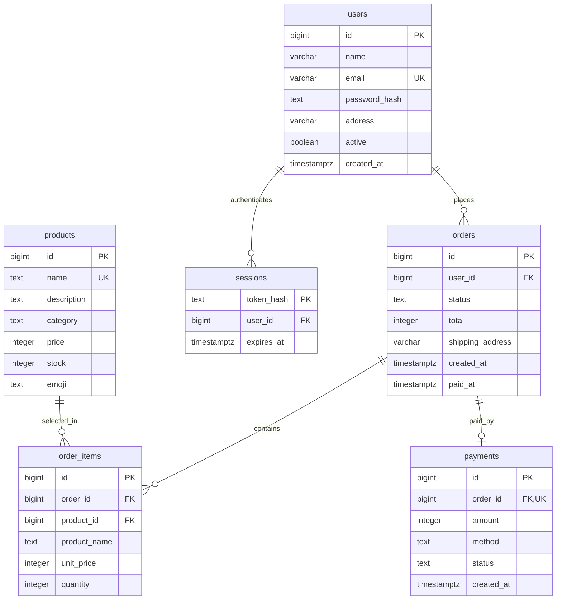

# 쇼핑몰 ERD

```mermaid
erDiagram
    users ||--o{ orders : places
    users ||--o{ sessions : authenticates
    orders ||--o{ order_items : contains
    products ||--o{ order_items : selected_in
    orders ||--o| payments : paid_by

    users {
        bigint id PK
        varchar name
        varchar email UK
        text password_hash
        varchar address
        boolean active
        timestamptz created_at
    }
    products {
        bigint id PK
        text name UK
        text description
        text category
        integer price
        integer stock
        text emoji
    }
    orders {
        bigint id PK
        bigint user_id FK
        text status
        integer total
        varchar shipping_address
        timestamptz created_at
        timestamptz paid_at
    }
    order_items {
        bigint id PK
        bigint order_id FK
        bigint product_id FK
        text product_name
        integer unit_price
        integer quantity
    }
    payments {
        bigint id PK
        bigint order_id FK, UK
        integer amount
        text method
        text status
        timestamptz created_at
    }
    sessions {
        text token_hash PK
        bigint user_id FK
        timestamptz expires_at
    }
```
